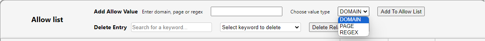
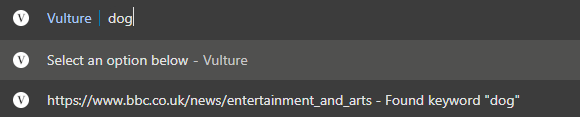
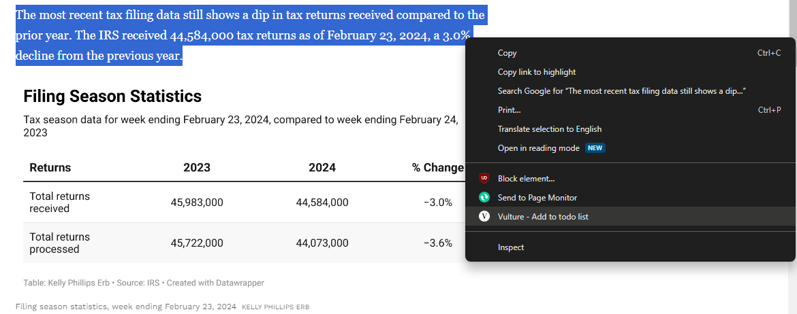
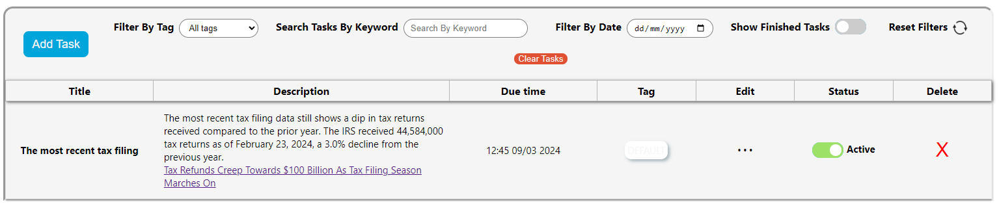
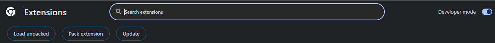
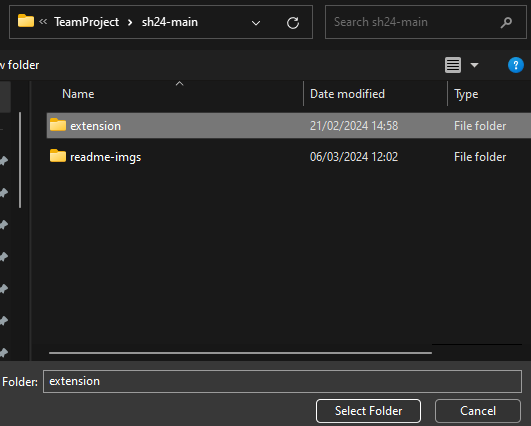

# Vulture - Productivity Chrome Extension

## Project Status: Development frozen after 13/3/24

Vulture is a chrome extension that allows for full text search for webpages that are allowed through the allow list.
It is recommended that vulture is pinned as an extension to the top bar.  
  
Click on the vulture icon, and then click on the small settings icon to enter the allow list page.  
  
Now you can add a setting to save certain domains (e.g. bbc.co.uk), specific pages, or a regex expression for urls to be saved.  
  
Now when you visit a site that has been enabled through the allow list, when you visit a page, that page will be available for search through the words that appear on the page.

To search, click on the omnibar, press v, then tab to start searching for words that appear in enabled pages. For example, if you type v <tab> dog you can find pages you have visited where the word "dog" has appeared, in order of most recently visited.  
  
Vulture also has a built in to do list that can be accessed through the popup. It can be accessed by clicking the "To Do List" button.  
  
Here you can manually add tasks, and vulture will send a system notification through chrome at the specified time.

Tasks can also be generated by highlighting text in a webpage, right clicking and then selecting the "Vulture - Add to todo list" option. This will generate a task, titled with the first five words from the highligted text, and the url to the page will be saved at the end of the description. The default date and time for the task is set to 24 hours after it is created, this can be edited in the todo list task view.  
  
  
## Installation
Install Vulture from the [Chrome Store](https://chromewebstore.google.com/detail/vulture/pngfonmbgcklngjlfmifknpegcfbimbo), or clone this repository and load the unpacked extension through chrome.
Do this by going to the "Manage Extensions" page, turn on "Developer Mode", and then click "Load unpacked". Select the folder called "extension" inside the repository to load vulture as an extension.
  

  

